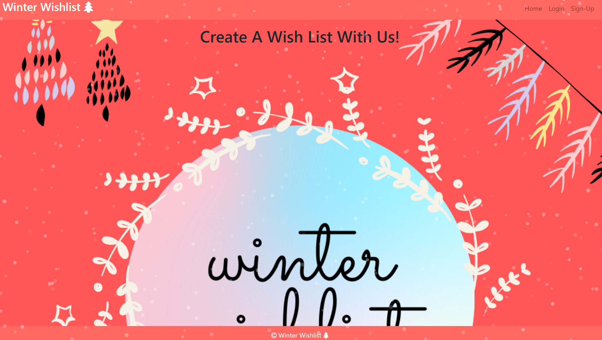
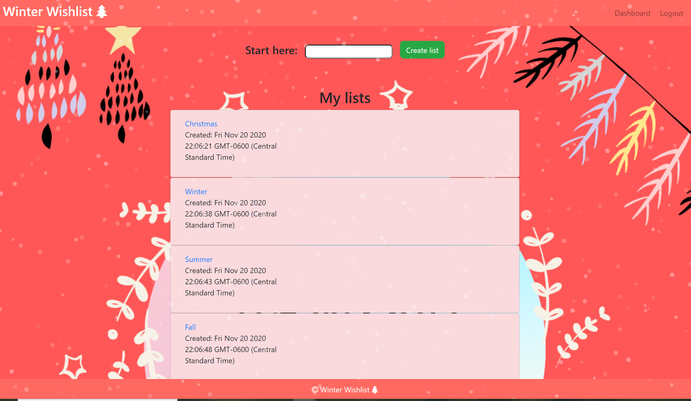

# Winter Wishlist 

## User Story:
As a user looking to create a wish list  
I WANT to be able to add items to my wish list  
SO THAT I can share my list with family for the Holiday  

## Acceptance Criteria:
GIVEN a welcome page     
WHEN I choose to sign-up  
THEN I am taken to a form where I can enter my username and password  
THEN my user credentials are saved and I am logged into the site  
WHEN I revisit the site at a later time and choose to login    
THEN I am prompted to enter my username and password  
WHEN I am signed in to the site  
THEN I have the options to create a wish list  
WHEN I click on the create list option  
THEN I am presented with a card that shows the list name I entered  
WHEN I add an item to the list    
THEN the item will be added to my wish list      
WHEN I revisit and login the wish list is displayed in my dashboard  

## Built With: 
* Express-Handlebars
* CSS
* Javascript
* Node Library:
     * express  
     * express-handlebars  
     * express-session  
     * mysql2  
     * sequelize  
     * bcrypt  
     * canvas  
     * connect-session-sequelize  
     * dotenv  

## GitHub Repository:
https://github.com/SMAtoSuccess/SMAtoSuccess.git

## Heroku Deployed App:
https://sma-to-success.herokuapp.com/

## Screenshots and updates:

## Contributions:
* Alexandra Nance
* Sydney Porter
* Mera Youssef
